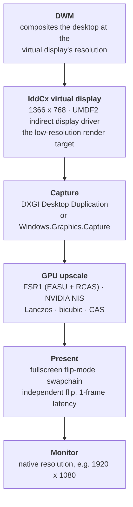

<div align="center">

# DisplayBoost

**Render the whole Windows desktop at a lower resolution — then GPU-upscale it to your monitor's native resolution before it ever reaches the display.**

[](LICENSE)
[](docs/00-overview.md)
[](docs/01-virtual-display-driver.md)
[](docs/06-roadmap.md)
[](CONTRIBUTING.md)

**English** | [Türkçe](README_TR.md)

</div>

---

> ### ⚠️ Project status: research phase — no code yet
>
> This repository currently contains a **feasibility study**, not an implementation. Every
> architectural decision below is backed by a source in [docs/07-references.md](docs/07-references.md),
> and every known obstacle is written down in [docs/05-risks-and-limitations.md](docs/05-risks-and-limitations.md)
> rather than glossed over. Read those two files before assuming this project will do what you hope.

---

## Table of contents

- [The problem](#the-problem)
- [How it works](#how-it-works)
- [The honest version: quality first, performance second](#the-honest-version-quality-first-performance-second)
- [Design goals](#design-goals)
- [Non-goals](#non-goals)
- [Upscaling backends](#upscaling-backends)
- [Roadmap](#roadmap)
- [Documentation](#documentation)
- [FAQ](#faq)
- [Requirements](#requirements)
- [Repository layout](#repository-layout)
- [Contributing](#contributing)
- [License](#license)
- [Acknowledgements](#acknowledgements)

---

## The problem

Resolution scaling on Windows is a **per-application** feature. A game only gets a nice upscaler
if its engine shipped one (DLSS, FSR 2/3, XeSS, TSR); the operating system, the browser, an
old fixed-resolution game from 2004 and a legacy line-of-business app get nothing but whatever
bilinear blur the GPU driver or the monitor's own scaler applies.

There is no general mechanism that says *"compose the desktop at 1366×768 and hand me a
sharp 1920×1080 image."* DisplayBoost is an attempt to build one.

## How it works

The core idea is to insert a **virtual display** into the Windows graphics stack. Windows
believes it is driving a real, low-resolution monitor. It renders the entire desktop there.
DisplayBoost then grabs that finished framebuffer, upscales it on the GPU, and presents the
result fullscreen on the physical monitor.



Two things make this unusual:

1. **It is display-centric, not window-centric.** Existing tools (Magpie, Lossless Scaling)
   capture *one window* and magnify it. DisplayBoost captures the *whole desktop*, so the
   taskbar, the browser, the desktop and the game are all in the same chain.
2. **It lowers the resolution Windows actually renders at.** Magnifying a window that already
   rendered at 1080p saves nothing. Rendering the desktop at 768p actually removes pixels
   from the pipeline.

## The honest version: quality first, performance second

This is the part most project READMEs would bury, so here it is up front.

The chain **saves** pixel-shading and fill-rate work — 1366×768 is about **1.05 MP versus
2.07 MP** at 1920×1080, so roughly half the per-pixel cost for work that scales with pixel
count. It also **costs** a capture read of the virtual framebuffer, an upscale pass, an extra
present, and one to three frames of added latency.

For a **fill-rate-bound game** that adds up to a real win. For the **desktop, UI and video**,
per-pixel shading is cheap and the fixed overhead can meet or exceed the savings — a wash or
a loss. And driver-level features such as **AMD Radeon Super Resolution** and
**NVIDIA Image Scaling** already do the same low-res→upscale trick *inside the present path*,
with no virtual display, no capture copy and no extra frame.

So the fair description is:

> **DisplayBoost is a coverage and quality feature, not a universal performance feature.**
> It is worth building for the cases the driver features do not reach — applications with no
> scaling support, legacy fixed-resolution software, and full-desktop coverage — and for the
> better upscale quality a dedicated shader pass can deliver compared to a monitor's internal
> scaler.

If you want raw frame rate in a modern game, use the in-game upscaler or your GPU driver's
scaling option first. See [docs/05-risks-and-limitations.md](docs/05-risks-and-limitations.md).

## Design goals

| Goal | Meaning |
|---|---|
| **No injection** | Capture out-of-process. Do not hook, patch or DLL-inject into other applications — it is friendlier to anti-cheat and far easier to reason about. |
| **Vendor-neutral scaling** | Everything in the core pipeline must run on any DirectX 11 capable GPU. No Tensor cores, no XMX, no NPUs required. |
| **Licence hygiene** | Only MIT-licensed upscalers may be linked into the core. This rules out copying shaders from GPL projects (see [docs/03-upscaling.md](docs/03-upscaling.md)). |
| **Reversible by design** | Enabling DisplayBoost must never be able to leave a user staring at a black screen. The physical monitor stays the Windows console display, and there is always a documented escape hatch. |
| **Measured, not claimed** | Every performance statement in these docs is either sourced or explicitly labelled as an estimate. The project's own benchmarks land with V1. |

## Non-goals

- **Frame generation.** Interpolating synthetic frames is a different problem with a very
  different latency profile.
- **Per-game injection.** No overlays, no hooks, no `dxgi.dll` replacement.
- **DRM-protected playback.** Content on an HDCP path cannot be captured; DisplayBoost will
  document this and step aside rather than fight it.
- **Covering the secure desktop.** UAC prompts, Ctrl+Alt+Del and the login screen are out of
  reach for user-mode capture. The physical display stays the console display precisely so
  that a user can never be locked out.

## Upscaling backends

Only **spatial** upscalers are usable here — the pipeline sees a finished framebuffer, with no
motion vectors, depth buffer or per-frame jitter from the renderer.

| Backend | Source | License | Status |
|---|---|---|---|
| **FSR 1** (EASU + RCAS) | [GPUOpen-Effects/FidelityFX-FSR](https://github.com/GPUOpen-Effects/FidelityFX-FSR) | MIT | ✅ Planned default |
| **NVIDIA NIS** (NVScaler / NVSharpen) | [NVIDIAGameWorks/NVIDIAImageScaling](https://github.com/NVIDIAGameWorks/NVIDIAImageScaling) | MIT | ✅ Planned |
| Lanczos, bicubic, bilinear, nearest, CAS | first-party HLSL | MIT | ✅ Planned |
| Anime4K, FSRCNNX, NNEDI3, ACNet | upstream projects | mixed | 🔶 Under evaluation |
| FSR 2 / 3 / 3.1 | — | MIT | ❌ Needs motion vectors, depth and jitter |
| DLSS | NVIDIA NGX | proprietary | ❌ Needs engine integration |
| Intel XeSS | — | — | ❌ Quality modes need motion vectors |
| RTX Video Super Resolution | NVVSR SDK | restricted | ❌ Video-only, not a general SDK |
| Integer scaling | — | — | ❌ 1366×768 → 1920×1080 is 1.40625×, not an integer factor |

Full comparison, integration notes and licensing analysis: [docs/03-upscaling.md](docs/03-upscaling.md).

## Roadmap

| Phase | Scope | Status |
|---|---|---|
| **V0 — Research** | Feasibility study, IddCx landscape, capture and present paths, upscaler licensing, risk register | ✅ Complete |
| **V1 — Driver-less prototype** | Capture a real display, upscale with FSR1 or NIS, present fullscreen on the same monitor. Produces the latency, GPU-cost and image-quality baseline without touching display topology. | 🔜 Next |
| **V2 — Virtual display** | IddCx indirect display driver as the low-resolution render target, captured and presented to the physical monitor. Targets IddCx 1.10 with a 1.5 fallback for Windows 10. | 📋 Planned |
| **V3 — Automatic profiles** | Detect the monitor's native mode, propose the optimal render resolution and scaler, apply in one click, per-application overrides. | 💡 Idea |

Milestones with success criteria: [ROADMAP.md](ROADMAP.md) · [docs/06-roadmap.md](docs/06-roadmap.md).

## Documentation

The research lives in [`docs/`](docs/README.md). Turkish translations mirror it 1:1 in
[`docs/tr/`](docs/tr/README.md).

| Document | What it covers |
|---|---|
| [00 — Overview](docs/00-overview.md) | Problem statement, target architecture, design principles, non-goals |
| [01 — Virtual display driver](docs/01-virtual-display-driver.md) | IddCx framework, version-to-Windows matrix, reference implementations, driver signing |
| [02 — Capture and present](docs/02-capture-and-present.md) | Capture APIs compared, present path, flip-model latency, cursor mapping |
| [03 — Upscaling](docs/03-upscaling.md) | Which upscalers we can actually use, and under which licence |
| [04 — Prior art](docs/04-prior-art.md) | Magpie, Lossless Scaling, Auto SR, AMD RSR — and how DisplayBoost differs |
| [05 — Risks and limitations](docs/05-risks-and-limitations.md) | The risk register. Read this before getting excited. |
| [06 — Roadmap](docs/06-roadmap.md) | Phased plan with success criteria and measurements |
| [07 — References](docs/07-references.md) | Every source used in the research |

## FAQ

**Is this DLSS / FSR 2 / XeSS?**
No. Those are temporal upscalers that require motion vectors, a depth buffer and per-frame
jitter from inside the renderer. DisplayBoost only ever sees a completed framebuffer, so it is
limited to spatial scalers: FSR 1, NIS, Lanczos, bicubic, CAS.

**Will it work with every game?**
No. A game must render on the virtual display and stay in windowed or borderless mode.
Exclusive fullscreen bypasses the scaler entirely. Anti-cheat behaviour around virtual
displays is largely unverified and is listed as an open risk.

**Will it lower my GPU usage?**
Not automatically. It removes per-pixel work and adds a fixed per-frame cost. The maths works
out for fill-rate-bound workloads and frequently does not for the desktop. There are also
cheaper ways to get the same saving: AMD RSR, NVIDIA NIS at the driver level, or simply
running at 720p.

**Then why build it at all?**
Coverage. Driver-level scaling only engages for fullscreen games. DisplayBoost covers software
that will never get an upscaler, and can apply a better filter than a monitor's built-in
scaler. See [docs/04-prior-art.md](docs/04-prior-art.md) for the positioning.

**What happens during a UAC prompt or on the lock screen?**
The secure desktop cannot be captured by any user-mode API — duplication returns
`DXGI_ERROR_ACCESS_LOST`. That is why the physical monitor stays the Windows console display:
the secure desktop always has somewhere real to appear. Recovery behaviour is a first-class
design constraint, not an afterthought.

**Is HDR supported?**
Not in V1. IddCx 1.10 added HDR10 and SDR wide colour gamut, and NVIDIA NIS ships Linear and
PQ HDR modes, so the path exists — but the colour pipeline is deferred until the SDR path is
solid.

**Why C++ and DirectX 11?**
Indirect display drivers must be written against IddCx, which means C++ and the WDF/UMDF2
driver model. D3D11 keeps the shared driver/app texture path simple and matches the ecosystem
that already solves these problems.

## Requirements

| Component | Requirement |
|---|---|
| Operating system | Windows 10 1903+ minimum (Windows.Graphics.Capture); **Windows 11 23H2+ recommended** (IddCx 1.10, HDR10 support) |
| GPU | DirectX 11 feature level 11, compute shader capable |
| Privileges | Administrator, to install the display driver |
| Build toolchain (future) | Visual Studio 2022, Windows Driver Kit, CMake 3.20+ |

Hybrid-graphics laptops (MUX / Optimus) are currently considered a **degraded configuration**:
a cross-adapter copy per frame can erase any gain. See
[docs/05-risks-and-limitations.md](docs/05-risks-and-limitations.md).

## Repository layout

```text
DisplayBoost/
├── .github/          Issue templates, pull request template, docs CI workflow
├── docs/             Research documentation (English — canonical)
│   └── tr/           Turkish translations, 1:1 with docs/
├── scripts/          Documentation tooling (bilingual parity check)
├── CHANGELOG.md      Keep a Changelog format
├── CONTRIBUTING.md   Commit conventions, branch model, documentation rules
├── LICENSE           MIT
├── README.md         This file
├── README_TR.md      Turkish README
├── ROADMAP.md        Milestone summary
└── SECURITY.md       Vulnerability disclosure policy
```

## Contributing

Contributions are welcome, including — especially — contributions that tell us we are wrong.
Corrections to the research, missing prior art, contradicting benchmarks and additional risks
are all valuable at this stage.

Because the documentation is bilingual, **an English change should be accompanied by its
Turkish counterpart** in `docs/tr/`. See [CONTRIBUTING.md](CONTRIBUTING.md) for the full
workflow and [CODE_OF_CONDUCT.md](CODE_OF_CONDUCT.md) for community expectations.

## License

[MIT](LICENSE) © 2026 raksix

Third-party components keep their own licences. Nothing from a GPL-licensed project is copied
into this repository — see the licence section of [docs/03-upscaling.md](docs/03-upscaling.md)
for the reasoning.

## Acknowledgements

The research in `docs/` builds directly on the work of others:

- **Microsoft** — the [Indirect Display Driver sample](https://github.com/microsoft/Windows-driver-samples/tree/main/video/IndirectDisplay)
  and the IddCx documentation that makes virtual displays possible at all.
- **[VirtualDrivers/Virtual-Display-Driver](https://github.com/VirtualDrivers/Virtual-Display-Driver)** —
  the reference community implementation of an IddCx virtual display, and the source of the
  driver-update black-screen warning we now document ourselves.
- **[Blinue/Magpie](https://github.com/Blinue/Magpie)** — the most complete open study of
  capture-and-scale on Windows. Used as a reference for architecture; not copied, as it is GPL-3.0.
- **[AMD GPUOpen](https://gpuopen.com/fidelityfx-superresolution/)** and
  **[NVIDIA GameWorks](https://github.com/NVIDIAGameWorks/NVIDIAImageScaling)** — for shipping
  FSR 1 and NIS under the MIT licence.
- **[SignPath Foundation](https://signpath.org/)** — free code signing for open-source projects,
  the path we intend to use to ship a signed driver.

<div align="center">

**[⬆ back to top](#displayboost)**

</div>
