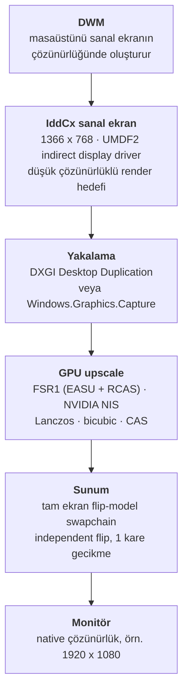

<div align="center">

# DisplayBoost

**Tüm Windows masaüstünü düşük çözünürlükte render et — sonra monitöre ulaşmadan önce GPU üzerinde native çözünürlüğe upscale et.**

[](LICENSE)
[](docs/tr/00-genel-bakis.md)
[](docs/tr/01-sanal-ekran-surucusu.md)
[](docs/tr/06-yol-haritasi.md)
[](CONTRIBUTING.md)

[English](README.md) | **Türkçe**

</div>

---

> **⚠️ Proje durumu: araştırma fazı — henüz kod yok**
>
> Bu repoda şu an bir **fizibilite çalışması** var, implementasyon değil. Aşağıdaki her mimari
> karar [docs/tr/07-kaynaklar.md](docs/tr/07-kaynaklar.md) içinde bir kaynağa dayanıyor ve
> bilinen her engel örtbas edilmek yerine
> [docs/tr/05-riskler-ve-sinirlar.md](docs/tr/05-riskler-ve-sinirlar.md) dosyasına yazıldı.
> Bu projenin umduğunuz şeyi yapacağını varsaymadan önce şu iki dosyayı okuyun.

---

## İçindekiler

- [Sorun](#sorun)
- [Nasıl çalışır](#nasıl-çalışır)
- [Dürüst anlatım: önce kalite, sonra performans](#dürüst-anlatım-önce-kalite-sonra-performans)
- [Tasarım hedefleri](#tasarım-hedefleri)
- [Hedef olmayanlar](#hedef-olmayanlar)
- [Upscale arka uçları](#upscale-arka-uçları)
- [Yol haritası](#yol-haritası)
- [Dokümantasyon](#dokümantasyon)
- [SSS](#sss)
- [Gereksinimler](#gereksinimler)
- [Repo yapısı](#repo-yapısı)
- [Katkı](#katkı)
- [Lisans](#lisans)
- [Teşekkürler](#teşekkürler)

---

## Sorun

Windows'ta çözünürlük ölçekleme **uygulama bazlı** bir özellik. Bir oyun ancak motoru bir
upscaler ile geldiyse (DLSS, FSR 2/3, XeSS, TSR) güzel bir ölçekleyiciye sahip oluyor;
işletim sistemi, tarayıcı, 2004'ten kalma sabit çözünürlüklü bir oyun ve eski bir kurumsal
uygulama ise GPU sürücüsünün veya monitörün kendi iç ölçekleyicisinin bıraktığı bilinear
bulanıklıktan başka bir şey alamıyor.

*"Masaüstünü 1366×768'de oluştur ve bana keskin bir 1920×1080 kare ver"* diyen genel bir
mekanizma yok. DisplayBoost bunu kurma denemesi.

## Nasıl çalışır

Temel fikir, Windows grafik zincirine bir **sanal ekran** yerleştirmek. Windows gerçek,
düşük çözünürlüklü bir monitörü sürdüğünü sanıyor ve tüm masaüstünü orada render ediyor.
DisplayBoost bu tamamlanmış framebuffer'ı alıp GPU üzerinde upscale ediyor ve sonucu fiziksel
monitörde tam ekran sunuyor.



Bu yaklaşımı alışılmadık yapan iki şey var:

1. **Pencere merkezli değil, ekran merkezli.** Mevcut araçlar (Magpie, Lossless Scaling)
   *tek bir pencereyi* yakalayıp büyütür. DisplayBoost *tüm masaüstünü* yakalar; görev çubuğu,
   tarayıcı, masaüstü ve oyun aynı zincirdedir.
2. **Windows'un gerçekten render ettiği çözünürlüğü düşürür.** Zaten 1080p render etmiş bir
   pencereyi büyütmek hiçbir şey kazandırmaz. Masaüstünü 768p'de render etmek ise zincirden
   gerçekten piksel çıkarır.

## Dürüst anlatım: önce kalite, sonra performans

Çoğu proje README'sinin gömeceği kısım burası, o yüzden en başa koyuyoruz.

Bu zincir piksel gölgeleme ve fill-rate işini **azaltır** — 1366×768 yaklaşık **1.05 MP**,
1920×1080 ise **2.07 MP**, yani piksel sayısıyla ölçeklenen işlerde maliyet kabaca yarıya
iner. Aynı zamanda sanal framebuffer'dan bir yakalama okuması, bir upscale geçişi, ekstra bir
present ve **bir ile üç kare arası ek gecikme** **maliyeti** getirir.

**Fill-rate bound bir oyunda** bu denklem gerçek bir kazanç üretebilir. **Masaüstü, arayüz ve
video** için piksel gölgeleme zaten ucuzdur ve sabit ek maliyet kazancı yakalayabilir hatta
aşabilir — başabaş ya da zarar. Üstelik **AMD Radeon Super Resolution** ve **NVIDIA Image
Scaling** gibi sürücü seviyesi özellikler aynı düşük çözünürlük → upscale numarasını zaten
*present yolunun içinde*, sanal ekran olmadan, yakalama kopyası olmadan ve ekstra kare
eklemeden yapıyor.

Yani adil tanım şu:

> **DisplayBoost bir kapsama ve kalite özelliğidir, genel bir performans özelliği değil.**
> Sürücü özelliklerinin ulaşamadığı durumlar için — ölçekleme desteği olmayan uygulamalar,
> eski sabit çözünürlüklü yazılımlar ve tam masaüstü kapsaması — ve monitörün iç
> ölçekleyicisine kıyasla ayrı bir shader geçişinin sağlayabileceği daha iyi upscale kalitesi
> için yapmaya değer.

Modern bir oyunda ham FPS istiyorsanız önce oyun içi upscaler'ı ya da GPU sürücünüzün
ölçekleme seçeneğini kullanın. Ayrıntı: [docs/tr/05-riskler-ve-sinirlar.md](docs/tr/05-riskler-ve-sinirlar.md).

## Tasarım hedefleri

| Hedef | Anlamı |
|---|---|
| **Enjeksiyon yok** | Yakalama süreç dışından yapılır. Diğer uygulamalara hook atılmaz, yama yapılmaz, DLL enjekte edilmez — anti-cheat açısından daha dostu ve akıl yürütmesi çok daha kolay. |
| **Üretici bağımsız ölçekleme** | Çekirdek hattaki her şey DirectX 11 destekli her GPU'da çalışmalı. Tensor çekirdeği, XMX veya NPU gerekmez. |
| **Lisans temizliği** | Çekirdeğe yalnızca MIT lisanslı upscaler'lar bağlanabilir. Bu, GPL projelerden shader kopyalamayı dışarıda bırakır (bkz. [docs/tr/03-olcekleme.md](docs/tr/03-olcekleme.md)). |
| **Tasarım gereği geri döndürülebilir** | DisplayBoost'u açmak kullanıcıyı asla siyah ekranda bırakamamalı. Fiziksel monitör Windows console display'i olarak kalır ve her zaman belgelenmiş bir kaçış yolu vardır. |
| **İddia değil ölçüm** | Bu dokümanlardaki her performans ifadesi ya kaynaklıdır ya da açıkça tahmin olarak etiketlenmiştir. Projenin kendi benchmark'ları V1 ile gelecek. |

## Hedef olmayanlar

- **Frame generation.** Sentetik kare üretmek, gecikme profili tamamen farklı olan başka bir problem.
- **Oyun başına enjeksiyon.** Overlay yok, hook yok, `dxgi.dll` değiştirme yok.
- **DRM korumalı oynatım.** HDCP yolundaki içerik yakalanamaz; DisplayBoost bununla savaşmak
  yerine durumu belgeleyip kenara çekilecek.
- **Secure desktop'ı kapsamak.** UAC istemleri, Ctrl+Alt+Del ve giriş ekranı kullanıcı modu
  yakalamasının erişimi dışında. Fiziksel ekranın console display olarak kalmasının nedeni
  tam olarak bu: kullanıcı asla kilitli kalmasın.

## Upscale arka uçları

Burada yalnızca **spatial** upscaler'lar kullanılabilir — hat tamamlanmış bir framebuffer
görür; renderer'dan motion vector, depth buffer veya kare başına jitter gelmez.

| Arka uç | Kaynak | Lisans | Durum |
|---|---|---|---|
| **FSR 1** (EASU + RCAS) | [GPUOpen-Effects/FidelityFX-FSR](https://github.com/GPUOpen-Effects/FidelityFX-FSR) | MIT | ✅ Planlanan varsayılan |
| **NVIDIA NIS** (NVScaler / NVSharpen) | [NVIDIAGameWorks/NVIDIAImageScaling](https://github.com/NVIDIAGameWorks/NVIDIAImageScaling) | MIT | ✅ Planlandı |
| Lanczos, bicubic, bilinear, nearest, CAS | birinci parti HLSL | MIT | ✅ Planlandı |
| Anime4K, FSRCNNX, NNEDI3, ACNet | üst projeler | karışık | 🔶 Değerlendiriliyor |
| FSR 2 / 3 / 3.1 | — | MIT | ❌ Motion vector, depth ve jitter gerektirir |
| DLSS | NVIDIA NGX | kapalı | ❌ Motor entegrasyonu gerektirir |
| Intel XeSS | — | — | ❌ Kalite modları motion vector ister |
| RTX Video Super Resolution | NVVSR SDK | kısıtlı | ❌ Sadece video, genel SDK değil |
| Integer scaling | — | — | ❌ 1366×768 → 1920×1080 = 1.40625×, tam sayı katı değil |

Tam karşılaştırma, entegrasyon notları ve lisans analizi: [docs/tr/03-olcekleme.md](docs/tr/03-olcekleme.md).

## Yol haritası

| Faz | Kapsam | Durum |
|---|---|---|
| **V0 — Araştırma** | Fizibilite çalışması, IddCx ortamı, yakalama ve sunum yolları, upscaler lisansları, risk kaydı | ✅ Tamamlandı |
| **V1 — Sürücüsüz prototip** | Gerçek bir ekranı yakala, FSR1 veya NIS ile upscale et, aynı monitörde tam ekran sun. Ekran topolojisine dokunmadan gecikme, GPU maliyeti ve görüntü kalitesi referansını üretir. | 🔜 Sıradaki |
| **V2 — Sanal ekran** | IddCx indirect display driver'ı düşük çözünürlüklü render hedefi yap, çıktısını yakala ve fiziksel monitöre sun. IddCx 1.10 hedeflenir, Windows 10 için 1.5 fallback. | 📋 Planlandı |
| **V3 — Otomatik profiller** | Monitörün native modunu algıla, optimal render çözünürlüğü ve upscaler'ı öner, tek tıkla uygula, uygulama başına geçersiz kılmalar. | 💡 Fikir |

Başarı kriterleriyle birlikte milestone'lar: [ROADMAP.md](ROADMAP.md) · [docs/tr/06-yol-haritasi.md](docs/tr/06-yol-haritasi.md).

## Dokümantasyon

Araştırma [`docs/`](docs/README.md) altında (İngilizce, kanonik). Türkçe çeviriler
[`docs/tr/`](docs/tr/README.md) içinde birebir eşleşir.

| Doküman | İçeriği |
|---|---|
| [00 — Genel bakış](docs/tr/00-genel-bakis.md) | Sorun tanımı, hedef mimari, tasarım ilkeleri, hedef olmayanlar |
| [01 — Sanal ekran sürücüsü](docs/tr/01-sanal-ekran-surucusu.md) | IddCx çatısı, sürüm-Windows matrisi, referans projeler, sürücü imzalama |
| [02 — Yakalama ve sunum](docs/tr/02-yakalama-ve-sunum.md) | Yakalama API'leri karşılaştırması, sunum yolu, flip-model gecikmesi, imleç eşlemesi |
| [03 — Ölçekleme](docs/tr/03-olcekleme.md) | Hangi upscaler'ları gerçekten kullanabiliriz ve hangi lisansla |
| [04 — Benzer projeler](docs/tr/04-benzer-projeler.md) | Magpie, Lossless Scaling, Auto SR, AMD RSR — ve DisplayBoost'un farkı |
| [05 — Riskler ve sınırlar](docs/tr/05-riskler-ve-sinirlar.md) | Risk kaydı. Heyecanlanmadan önce okuyun. |
| [06 — Yol haritası](docs/tr/06-yol-haritasi.md) | Başarı kriterleri ve ölçümlerle fazlı plan |
| [07 — Kaynaklar](docs/tr/07-kaynaklar.md) | Araştırmada kullanılan her kaynak |

## SSS

**Bu DLSS / FSR 2 / XeSS mi?**
Hayır. Onlar motion vector, depth buffer ve kare başına jitter gerektiren temporal
upscaler'lar. DisplayBoost yalnızca tamamlanmış bir framebuffer görür, dolayısıyla spatial
ölçekleyicilerle sınırlıdır: FSR 1, NIS, Lanczos, bicubic, CAS.

**Her oyunda çalışır mı?**
Hayır. Oyunun sanal ekranda render etmesi ve windowed veya borderless modda kalması gerekir.
Exclusive fullscreen scaler'ı tamamen atlar. Sanal ekranlar konusunda anti-cheat davranışı
büyük ölçüde doğrulanmamış ve açık risk olarak listelenmiş durumda.

**GPU kullanımımı düşürür mü?**
Otomatik olarak hayır. Piksel başına işi azaltır, kare başına sabit bir maliyet ekler.
Matematik fill-rate bound iş yükleri için çıkar, masaüstü için çoğu zaman çıkmaz. Ayrıca aynı
kazancı elde etmenin daha ucuz yolları var: sürücü seviyesinde AMD RSR, NVIDIA NIS veya
basitçe 720p'de çalışmak.

**Öyleyse neden yapıyoruz?**
Kapsama. Sürücü seviyesi ölçekleme yalnızca tam ekran oyunlarda devreye giriyor. DisplayBoost
asla bir upscaler'a kavuşmayacak yazılımları kapsıyor ve monitörün dahili ölçekleyicisinden
daha iyi bir filtre uygulayabiliyor. Konumlandırma için
[docs/tr/04-benzer-projeler.md](docs/tr/04-benzer-projeler.md).

**UAC isteminde veya kilit ekranında ne oluyor?**
Secure desktop hiçbir kullanıcı modu API'si tarafından yakalanamaz — duplication
`DXGI_ERROR_ACCESS_LOST` döndürür. Fiziksel monitörün Windows console display'i olarak
kalmasının nedeni bu: secure desktop'ın her zaman görünecek gerçek bir yeri olmalı.
Kurtarma davranışı sonradan eklenen bir detay değil, birinci sınıf tasarım kısıtı.

**HDR destekleniyor mu?**
V1'de hayır. IddCx 1.10 HDR10 ve SDR wide color gamut ekledi, NVIDIA NIS ise Linear ve PQ HDR
modları sunuyor, yani yol mevcut — ama renk hattı SDR yolu oturana kadar ertelendi.

**Neden C++ ve DirectX 11?**
Indirect display driver'lar IddCx'e karşı yazılmak zorunda, bu da C++ ve WDF/UMDF2 sürücü
modeli demek. D3D11 ise sürücü/uygulama arası paylaşılan doku yolunu basit tutuyor ve bu
problemleri zaten çözmüş ekosistemle uyumlu.

## Gereksinimler

| Bileşen | Gereksinim |
|---|---|
| İşletim sistemi | Minimum Windows 10 1903+ (Windows.Graphics.Capture); **önerilen Windows 11 23H2+** (IddCx 1.10, HDR10 desteği) |
| GPU | DirectX 11 feature level 11, compute shader destekli |
| Yetkiler | Ekran sürücüsünü kurmak için yönetici |
| Derleme zinciri (gelecekte) | Visual Studio 2022, Windows Driver Kit, CMake 3.20+ |

Hibrit grafikli dizüstüler (MUX / Optimus) şu an **düşürülmüş yapılandırma** sayılıyor:
kare başına adaptörler arası kopya kazancı silebilir. Bkz.
[docs/tr/05-riskler-ve-sinirlar.md](docs/tr/05-riskler-ve-sinirlar.md).

## Repo yapısı

```text
DisplayBoost/
├── .github/          Issue şablonları, PR şablonu, docs CI workflow
├── docs/             Araştırma dokümantasyonu (İngilizce — kanonik)
│   └── tr/           Türkçe çeviriler, docs/ ile birebir
├── scripts/          Dokümantasyon araçları (iki dillilik parity kontrolü)
├── CHANGELOG.md      Keep a Changelog formatı
├── CONTRIBUTING.md   Commit konvansiyonları, branch modeli, doküman kuralları
├── LICENSE           MIT
├── README.md         İngilizce README
├── README_TR.md      Bu dosya
├── ROADMAP.md        Milestone özeti
└── SECURITY.md       Güvenlik açığı bildirim politikası
```

## Katkı

Katkılar memnuniyetle karşılanır — özellikle de **yanıldığımızı söyleyen** katkılar.
Araştırmadaki düzeltmeler, gözden kaçan benzer projeler, çelişen benchmark'lar ve ek riskler
bu aşamada hepsi değerli.

Dokümantasyon iki dilli olduğu için **İngilizce bir değişikliğin yanında `docs/tr/` içindeki
Türkçe karşılığı da** gelmelidir. Tam iş akışı için [CONTRIBUTING.md](CONTRIBUTING.md),
topluluk beklentileri için [CODE_OF_CONDUCT.md](CODE_OF_CONDUCT.md).

## Lisans

[MIT](LICENSE) © 2026 raksix

Üçüncü parti bileşenler kendi lisanslarını korur. GPL lisanslı hiçbir projeden bu repoya kod
kopyalanmamıştır — gerekçe için [docs/tr/03-olcekleme.md](docs/tr/03-olcekleme.md) lisans bölümü.

## Teşekkürler

`docs/` içindeki araştırma doğrudan başkalarının işinin üzerine kurulu:

- **Microsoft** — [Indirect Display Driver örneği](https://github.com/microsoft/Windows-driver-samples/tree/main/video/IndirectDisplay)
  ve sanal ekranları mümkün kılan IddCx dokümantasyonu.
- **[VirtualDrivers/Virtual-Display-Driver](https://github.com/VirtualDrivers/Virtual-Display-Driver)** —
  IddCx sanal ekranın referans topluluk implementasyonu ve artık bizim de belgelediğimiz
  sürücü güncellemesi siyah ekran uyarısının kaynağı.
- **[Blinue/Magpie](https://github.com/Blinue/Magpie)** — Windows'ta yakalama ve ölçeklemenin
  en kapsamlı açık incelemesi. Mimari referans olarak kullanıldı; GPL-3.0 olduğu için kopyalanmadı.
- **[AMD GPUOpen](https://gpuopen.com/fidelityfx-superresolution/)** ve
  **[NVIDIA GameWorks](https://github.com/NVIDIAGameWorks/NVIDIAImageScaling)** — FSR 1 ve NIS'i
  MIT lisansıyla sundukları için.
- **[SignPath Foundation](https://signpath.org/)** — açık kaynak projeler için ücretsiz kod
  imzalama; imzalı sürücü yayınlamak için kullanmayı planladığımız yol.

<div align="center">

**[⬆ başa dön](#displayboost)**

</div>
