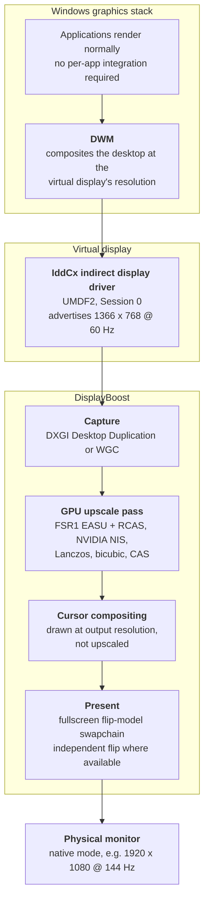

# 00 — Overview

> **English** | [Türkçe](tr/00-genel-bakis.md)

## The problem

Windows gives applications a fixed set of ways to adapt to a display they cannot fill:
the application implements its own scaling, the GPU driver scales the finished frame, or the
monitor's internal scaler stretches the signal. Only the first is any good, and it requires the
application to ship it — DLSS, FSR 2/3, XeSS and TSR are all engine-side features.

Everything else falls through the cracks. The desktop, the browser, a fixed-resolution game from
2004, a legacy line-of-business tool: none of them will ever receive a temporal upscaler, and
consequently they get bilinear blur from whichever scaler happens to be last in the chain.

There is no mechanism in Windows that says *"compose at 1366×768, then hand me a sharp
1920×1080 image."* DisplayBoost is an attempt to build one.

## What DisplayBoost is

DisplayBoost inserts a **virtual display** into the Windows graphics stack at a reduced
resolution. Windows treats it as a real monitor and renders the entire desktop there. The
project then captures that finished framebuffer, upscales it on the GPU, and presents the result
fullscreen on the physical monitor.

The important property is that **the entire desktop is in the chain**. The taskbar, the browser,
the desktop, an emulator and a game all get the same treatment, because they are all just
windows on the virtual display.

## What makes this different from existing tools

| | Magpie, Lossless Scaling | Driver-level RSR / NIS | DisplayBoost |
|---|---|---|---|
| Unit of capture | A single window | The application's present call | The whole desktop |
| Reduces render resolution | No — magnifies an already-rendered frame | Yes | Yes |
| Works with software that has no scaler | Yes, if you can capture the window | No — fullscreen games only | Yes, by construction |
| Extra copies per frame | One capture, one present | None | One capture, one upscale, one present |
| Needs a display driver | No | No | Yes |

DisplayBoost's niche is precisely the three columns where the alternatives are weak: **software
that will never get an upscaler, software whose window you cannot capture reliably, and cases
where a dedicated shader pass beats the monitor's internal scaler.**

## Where the cost actually goes

The honest accounting, expanded in [05 — Risks and limitations](05-risks-and-limitations.md):

**Saved.** About half the pixel work. 1366×768 is ≈1.05 MP; 1920×1080 is ≈2.07 MP. Per-pixel
shading, depth and ROP cost scale with pixel count, so fill-rate-bound rendering gets close to a
2× reduction there.

**Not saved.** Everything that is not per-pixel: geometry, vertex and tessellation work, compute
shaders, culling, draw submission, and all CPU-side cost. A draw-call-bound game gains nothing.

**Added.** A capture read of the virtual framebuffer, an upscale pass, an extra present, and one
to three frames of latency. If the virtual display and the physical monitor sit on different
adapters, add a cross-adapter copy per frame — usually the single largest cost in the chain.

The net is therefore **workload-dependent and frequently negative.** That is why this project is
documented as a coverage and quality feature rather than a performance feature. The
[overview section of the README](../README.md#the-honest-version-quality-first-performance-second)
says the same thing more bluntly.

## Design principles

**No injection.** Frames are captured out of process with documented APIs. Nothing is hooked,
patched or injected into another process. This is friendlier to anti-cheat, easier to debug,
and does not make DisplayBoost responsible for another application's stability.

**Vendor-neutral scaling.** The core pipeline must run on any DirectX 11 feature level 11 GPU.
That rules out DLSS, XeSS and any NPU-accelerated path, and it is why the upscaler shortlist in
[03 — Upscaling](03-upscaling.md) is entirely MIT-licensed spatial filters.

**Licence hygiene.** Only components that can be redistributed under DisplayBoost's MIT licence
may enter the tree. Algorithms whose upstream is MIT (FSR 1, NVIDIA NIS) are pulled from the
upstream project, never from an intermediate GPL project that has already ported them. See the
licence section of [03 — Upscaling](03-upscaling.md).

**Reversible by design.** A display driver that takes over the user's screen can strand them.
The physical monitor therefore always remains the Windows console display, so the secure desktop
and the recovery UI always have somewhere real to appear. Install and uninstall must be
reversible without safe mode, and a documented escape hatch must exist for the cases where they
are not.

**Measured, not claimed.** Every performance statement in these documents is either sourced or
labelled as an estimate. The project's own latency and GPU-cost numbers arrive with V1, measured
with a documented methodology.

## Non-goals

| Non-goal | Why |
|---|---|
| Frame generation | A different problem with a different latency profile. Interpolated frames do not reduce render cost, and they add latency by design. |
| Per-application injection | Hooks and overlays break anti-cheat, break on updates, and make the project responsible for crashes it did not cause. |
| DRM-protected playback | Content on an HDCP path is not capturable by any of the APIs available here. The correct behaviour is to detect this and step aside. |
| Capturing the secure desktop | UAC, Ctrl+Alt+Del and the login screen are outside user-mode capture. This is a hard constraint of the platform, not a gap to close. |
| Higher resolutions than native | That is supersampling, the opposite direction. The project lowers render resolution and reconstructs; it does not render more pixels. |

## Scope boundary

DisplayBoost is **display-centric**. It does not know or care what any particular application is
doing. That is the source of its generality and also the source of its ceiling: it can never use
the motion vectors, depth buffers or jitter offsets that make modern temporal upscalers look as
good as they do. Those exist only inside the renderer, and reaching them would require the
injection the project has ruled out.

## Glossary

| Term | Meaning |
|---|---|
| **CAS** | Contrast Adaptive Sharpening. An AMD FidelityFX sharpening filter; shipped in the MIT-licensed FidelityFX SDK. |
| **DDA** | DXGI Desktop Duplication API. A low-level, polling-based, monitor-level capture API available since Windows 8. |
| **DWM** | Desktop Window Manager. The Windows compositor. Everything on screen passes through it. |
| **DXGI** | DirectX Graphics Infrastructure. The layer that owns adapters, outputs and swapchains. |
| **EASU / RCAS** | The two passes of FSR 1: Edge Adaptive Spatial Upsampling, then Robust Contrast Adaptive Sharpening. |
| **EDID** | Extended Display Identification Data. The block a monitor uses to describe itself. An IddCx driver can supply a synthetic one to control which modes Windows offers. |
| **Fill-rate** | How many pixels per second a GPU can shade. Work that scales with pixel count is called fill-rate bound. |
| **Flip model** | A swapchain presentation model where the back buffer is handed to the compositor rather than copied. Required for modern low-latency presentation. |
| **FSR** | AMD FidelityFX Super Resolution. FSR 1 is spatial and usable here; FSR 2, 3 and 3.1 are temporal and are not. |
| **HDCP** | High-bandwidth Digital Content Protection. The reason protected video appears black in capture. |
| **IddCx** | The Indirect Display Driver Class eXtension. The API surface for writing a user-mode virtual display driver. |
| **IDD** | Indirect Display Driver. A UMDF2 driver that creates displays not attached to a physical GPU output. |
| **Independent flip** | A presentation mode in which the swapchain goes straight to the display without the compositor, giving the lowest latency. |
| **LUID** | Locally Unique Identifier for a graphics adapter. The reliable way to name a specific GPU. |
| **MPO** | Multiplane Overlay. Hardware planes that let a compositor skip a copy for some content, including a fullscreen swapchain. |
| **MUX** | The hardware switch on some laptops that decides which GPU drives the internal panel. A source of cross-adapter surprises. |
| **NIS** | NVIDIA Image Scaling. A spatial upscaler and sharpener, released as an MIT-licensed SDK with compute shader source. |
| **Present** | Handing a finished frame to the display path. The last step before photons. |
| **Secure desktop** | The isolated desktop shown for UAC prompts, Ctrl+Alt+Del and the login screen. Not capturable from user mode. |
| **Session 0** | The non-interactive Windows session where services and UMDF drivers run. No windowing, no user session. |
| **Swapchain** | The set of buffers an application renders into and presents from. |
| **TDR** | Timeout Detection and Recovery. Windows resetting a GPU that stopped responding; a consideration for any long-running GPU pass. |
| **UMDF2** | User-Mode Driver Framework version 2. The driver model an IDD must use. |
| **VRR** | Variable Refresh Rate. G-Sync and FreeSync. An extra composition layer frequently breaks it. |
| **WDDM** | Windows Display Driver Model. The version gate for most of the graphics behaviour described here. |
| **WGC** | Windows.Graphics.Capture. The modern WinRT capture API, available from Windows 10 1903. |

## Continue reading

- [01 — Virtual display driver](01-virtual-display-driver.md) — the driver half of the architecture
- [02 — Capture and present](02-capture-and-present.md) — the user-mode half
- [03 — Upscaling](03-upscaling.md) — which filters are usable, and their licences
- [05 — Risks and limitations](05-risks-and-limitations.md) — everything that can go wrong
