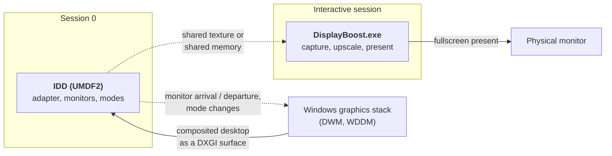

# 01 — Virtual Display Driver

> **English** | [Türkçe](tr/01-sanal-ekran-surucusu.md)

The virtual display is the component that makes DisplayBoost possible and the component most
likely to cause trouble. It is a real Windows driver, it runs with real privileges, and it is the
only part of the architecture that cannot be replaced with a library call.

## What an indirect display driver is

The **Indirect Display Driver** (IDD) model is Microsoft's supported way to create displays that
are not attached to a physical GPU output. Documented scenarios include remote display, virtual
displays for VDI, and USB-attached display dongles.

An IDD is a **UMDF2 user-mode driver** built against **IddCx** (the Indirect Display Driver Class
eXtension). The properties that matter for this project:

- It is a **user-mode** driver. It runs in `WUDFHost.exe` in Session 0, and the driver documentation
  states that its instability does not affect the stability of the system as a whole. In practice
  this means a bug is far more likely to produce a hung display than a blue screen.
- It runs in **Session 0 with no user-session components**. This is crucial: the driver cannot
  create windows, and it cannot present to the user's desktop. Any UI must live in a separate
  user-session process.
- It may use **any DirectX API** to process the desktop image, but must not call GDI, windowing
  APIs, OpenGL or Vulkan.
- It must be built as a **universal Windows driver** so that one binary can run across Windows
  releases.
- At build time the driver declares the IddCx version it was built against; the OS loads the
  matching IddCx version at runtime.

Source: [Indirect display driver overview](https://learn.microsoft.com/en-us/windows-hardware/drivers/display/indirect-display-driver-model-overview).

### The shape of the driver

The dashed path is the design question deferred to V2: getting the driver's frames into a
user-session process without an extra copy per frame. See
[02 — Capture and present](02-capture-and-present.md).

## IddCx versions and Windows support

Verified against Microsoft Learn. A driver built against a given IddCx version will only load on
Windows releases that ship it or a newer one.

| IddCx version | `IddCxGetVersion` | What it added | Ships with |
|---|---|---|---|
| **1.11** | `0x1B00` | **D3D12 support**, DisplayID-only descriptors, atomic I2C, updatable static desktop reencode count | Windows 11 |
| **1.10** | `0x1A80` | HDR10, SDR wide colour gamut, runtime power management | Windows "2024" servicing |
| **1.10** | `0x1A00` | HDR10 and SDR wide colour gamut | Windows 11 23H2 |
| 1.9 | `0x1900` | `IddCxSetRealtimeGPUPriority`; disallows UMDF process pooling | Windows 11 22H2 |
| 1.8 | `0x1800` | `IDDCX_ADAPTER_FLAGS_PREFER_PRECISE_PRESENT_REGIONS` | Windows 11 21H2 |
| 1.7 | `0x1700` | `IddCxMonitorQueryHardwareCursor2`; deprecates `IDDCX_ADAPTER_FLAGS_CAN_USE_MOVE_REGIONS` | Windows Server 2022 |
| 1.6 | `0x1600` | `IddCxSwapChainGetPhysicallyContiguousAddress` | — |
| **1.5** | `0x1500` | `IddCxSwapChainInSystemMemory`, `IddCxSwapChainReleaseAndAcquireSystemBuffer` | Windows 10 20H1 through 22H2 |
| 1.4 | `0x1400` | Remote-session ID drivers, `EvtIddCxMonitorGetPhysicalSize`, **`IddCxAdapterSetRenderAdapter`**, `IddCxAdapterDisplayConfigUpdate` | Windows 10 1903 / 1909 |
| 1.3 | `0x1300` / `0x1380` | Loading drivers built against 1.3+ | Windows 10 1803 / 1809 |
| 1.2 | `0x1200` | `IddCxGetVersion`, `IddCxReportCriticalError`, `IddCxMonitorSetSrmList`, `IddCxMonitorGetSrmListVersion` | Windows 10 1709 |
| 1.0 | — | Initial version | Windows 10 1607 / 1703 |

**Implications for DisplayBoost:**

- **Windows 11 23H2 (IddCx 1.10) is the natural target** because that is where HDR10 and wide
  colour gamut arrive.
- **Windows 10 is capped at IddCx 1.5**, which means no HDR and no D3D12. A Windows 10 build has
  to fall back to `IddCxSwapChainReleaseAndAcquireBuffer` rather than `...Buffer2`.
- **D3D12 is only available from IddCx 1.11**, and using it changes the synchronisation model:
  the driver must explicitly tell the OS which command queue will read the surface. D3D11 remains
  the simpler choice and matches the rest of the pipeline.
- A driver built against a newer IddCx can still run on older Windows using runtime feature
  checks — `IddCxGetVersion` plus `IddCxCheckOsFeatureSupport`, which **must be called before any
  adapter is created**.

Sources: [IddCx versions](https://learn.microsoft.com/en-us/windows-hardware/drivers/display/iddcx-versions),
[Updates for IddCx 1.11 and later](https://learn.microsoft.com/en-us/windows-hardware/drivers/display/iddcx1-dot-11-updates).

## The DDIs that matter

| Callback or function | Role |
|---|---|
| `IddCxAdapterInitAsync` | Creates the graphics adapter representing the indirect display device |
| `EVT_IDD_CX_ADAPTER_COMMIT_MODES` | The OS commits a mode set on the adapter |
| `IddCxMonitorCreate` / `IddCxMonitorCreate2` | Creates a monitor from a description |
| `IddCxMonitorArrival` / `IddCxMonitorDeparture` | Reports a monitor being connected or disconnected |
| `EvtIddCxParseMonitorDescription` | The driver parses and validates the supplied monitor description |
| `EvtIddCxMonitorAssignSwapChain` / `...UnassignSwapChain` | The OS hands over (or takes back) the swapchain used to deliver frames |
| `EvtIddCxSwapChainReleaseAndAcquireBuffer` | The driver releases the previous frame and acquires the next |
| `IddCxSwapChainReleaseAndAcquireBuffer` | Acquires the composited desktop image as a DXGI resource |
| `IddCxSwapChainReleaseAndAcquireBuffer2` | Required for FP16/HDR adapters; returns D3D12 resources when the driver registered an `ID3D12Device` |
| `IddCxSwapChainSetDevice` / `SetDevice2` | Associates the D3D11 or D3D12 device with the swapchain |
| `IddCxSwapChainFinishedProcessingFrame` | Signals that the driver is done with the current frame |
| `IddCxAdapterSetRenderAdapter` | Selects which GPU processes the frames — **the cross-adapter mitigation** |
| `IddCxSetRealtimeGPUPriority` | Requests realtime GPU priority (IddCx 1.9+) |

### Monitor descriptions

An IDD tells the OS what its monitor is by supplying one of:

- **An EDID blob** (`IDDCX_MONITOR_DESCRIPTION_TYPE_EDID`) — a 128-byte base block plus optional
  extensions. This is how community drivers advertise custom resolutions, refresh rates, colour
  depth and HDR metadata.
- **A monitor mode list** — a simpler, structured list of supported modes.
- **A DisplayID-only descriptor** (`IDDCX_MONITOR_DESCRIPTION_TYPE_DISPLAYID`) — new in IddCx 1.11,
  for descriptions that contain no EDID blocks at all.

The driver must advertise every mode it wants Windows to offer. A mode that is not in the
description will not appear in Settings, regardless of what the driver can technically handle.

**For DisplayBoost this is the control surface.** The virtual display's whole purpose is to offer
a small set of deliberately low resolutions — 1280×720, 1366×768, 1600×900 — plus 2×-friendly
options such as 960×540 for users who prefer integer-friendly content.

## Reference implementations

| Project | IddCx | Signed | Licence | Notes |
|---|---|---|---|---|
| [microsoft/Windows-driver-samples — `video/IndirectDisplay`](https://github.com/microsoft/Windows-driver-samples/tree/main/video/IndirectDisplay) | 1.2 (sample) | ✗ | **MS-PL** | The canonical example. Enumerates a single monitor, no HDR, no configuration. Requires test signing to install. |
| [VirtualDrivers/Virtual-Display-Driver](https://github.com/VirtualDrivers/Virtual-Display-Driver) | **1.10** | ✅ | **MIT** | ~10.1k stars, 409 forks. HDR 10/12-bit, hardware cursor, custom EDID, ARM64, floating-point refresh rates. Configured via `vdd_settings.xml`. Ships a control app and is on WinGet. |
| [nomi-san/parsec-vdd](https://github.com/nomi-san/parsec-vdd) | 1.5 | ✅ | (check the repository) | "ParsecVDisplay". A standalone wrapper around Parsec's VDD, driven from user mode. Also a **SignPath Foundation** project. |
| `usbmmid_v2` (spacedesk / datronicsoft) | — | ✅ | Closed | 8-bit SDR only. Distributed with spacedesk. |
| [ge9/IddSampleDriver](https://github.com/ge9/IddSampleDriver) | 1.2 | ✗ | MIT / CC0 | The fork source for the Virtual Display Driver effort. |
| [SudoMaker/SudoVDA](https://github.com/SudoMaker/SudoVDA) | — | ✗ | (check the repository) | A full rewrite descended from the MTT Virtual Display Driver lineage. |

The Virtual Display Driver project's own comparison table is worth reading directly, since it
tracks features across these projects as they change.

**What DisplayBoost takes from them:** the *programming model* (how to structure an adapter and
monitor, how to advertise modes) is common to all of them. What is new is the destination — every
one of these projects exists to *send the frame somewhere else* (a stream, a headset, a recorder),
whereas DisplayBoost sends it back to the local physical display.

## Driver signing and distribution

This is where most hobby display drivers die, so it is worth being concrete.

**Can a user install an unsigned driver?** Not without weakening the OS. The available escape
hatches are:

- **Test signing**: `bcdedit /set testsigning on`, plus a reboot, with a test-signed package.
  Every reboot shows a desktop watermark, and some anti-cheat software objects.
- **Disabling Driver Signature Enforcement** at boot. Temporary, per-boot, unusable as a
  distribution strategy.

**The real options:**

| Path | What it needs | Suitable for |
|---|---|---|
| **Attestation signing** | A Microsoft Partner Center account and an **EV code-signing certificate**; no HLK testing | Most drivers, including this one |
| **WHQL / HLK certification** | The same, plus formal testing against the Hardware Lab Kit | Vendors needing logo certification; unnecessary here |
| **SignPath Foundation** | An open-source project that passes their review | **The likely path for DisplayBoost** |

The **SignPath Foundation** provides free OV-level code signing for qualifying open-source
projects, with CI integration and signing keys held in the Foundation's HSM. Both the Virtual
Display Driver and ParsecVDisplay use it — which is strong evidence that it is a workable route
for exactly this kind of project.

Sources: [SignPath Foundation](https://signpath.org/),
[Attestation Sign Windows Drivers](https://learn.microsoft.com/en-us/windows-hardware/drivers/dashboard/code-signing-attestation),
[Driver Code Signing Requirements](https://learn.microsoft.com/en-us/windows-hardware/drivers/dashboard/code-signing-reqs).

### A note on the driver's licence

The Microsoft sample is **MS-PL**, not MIT. If DisplayBoost derives its driver from that sample,
the derived driver source must remain under MS-PL, producing a mixed-licence repository. The
alternative is writing the driver from scratch against the documented IddCx API, which the API
documentation permits but which is slower and riskier. This is an open decision recorded in
[03 — Upscaling](03-upscaling.md) and [06 — Roadmap](06-roadmap.md).

## Known pitfalls

| Pitfall | Detail |
|---|---|
| **Black screen after a GPU driver update** | Documented by the Virtual Display Driver project: during a major GPU or chipset driver update Windows re-enumerates display devices and may promote the virtual display ahead of the physical one. Since the virtual display has no physical screen, the result is a black screen on a working system. Their advice is to uninstall the virtual display before a GPU driver update, and to recover with `Win+P` or Safe Mode. |
| **ARM64 on Windows 11 24H2** | May require test signing even for a signed package. |
| **HDR requires Windows 11 23H2+** | IddCx 1.10 is the version that adds HDR10; earlier releases cannot do it at all. |
| **Monitor count** | Windows caps the total number of active displays, and each driver instance typically contributes one monitor. Do not assume unlimited virtual displays. |
| **Render adapter selection** | On hybrid systems, matching the render adapter by name is unreliable. Community drivers resolve a stable `LUID` from the PCI bus number instead — a detail worth copying. |
| **Instability is survivable, invisibility is not** | A crashed virtual display leaves a monitor that Windows believes exists but that shows nothing. The uninstall path must work without a working screen. |

## Implications for DisplayBoost

1. **Target IddCx 1.10 on Windows 11 23H2+, with a 1.5 fallback path for Windows 10.** HDR is a
   1.10 feature, and the API differences between 1.5 and 1.10 are manageable with runtime checks.
2. **Advertise a small, deliberate mode list.** The driver's value is in offering the exact low
   resolutions that make sense, not in offering everything.
3. **Pin the render adapter explicitly** using `IddCxAdapterSetRenderAdapter` and a PCI-derived
   `LUID`, so that hybrid systems do not pay a cross-adapter copy per frame.
4. **The driver does not present.** It only produces frames. All windowing, cursor work and
   presentation lives in the user-session application.
5. **Plan the signing route before writing code.** Applying to SignPath Foundation takes time and
   requires the repository to be established first.
6. **Never make the virtual display the only display.** The physical monitor stays as the Windows
   console display, which is what keeps UAC, the lock screen and recovery usable.

## Continue reading

- [02 — Capture and present](02-capture-and-present.md) — what happens to the frames
- [03 — Upscaling](03-upscaling.md) — the licence question for the driver source
- [05 — Risks and limitations](05-risks-and-limitations.md) — the driver's failure modes
