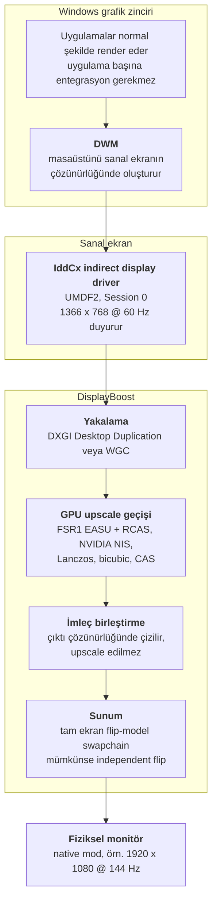

# 00 — Genel bakış

> [English](../00-overview.md) | **Türkçe**

## Sorun

Windows, bir ekranı tam dolduramayan uygulamalara sabit sayıda adaptasyon yolu sunar: uygulama
kendi ölçeklemesini uygular, GPU sürücüsü tamamlanmış kareyi ölçekler veya monitörün iç
ölçekleyicisi sinyali gerer. Bunlardan yalnızca ilki iyidir ve uygulamanın onu getirmesini
gerektirir — DLSS, FSR 2/3, XeSS ve TSR hep motor tarafı özellikler.

Geri kalan her şey çatlaklardan düşer. Masaüstü, tarayıcı, 2004'ten kalma sabit çözünürlüklü bir
oyun, eski bir kurumsal araç: hiçbiri temporal bir upscaler'a kavuşmayacak ve sonuç olarak
zincirde son kalan hangi ölçekleyici varsa onun bilinear bulanıklığını alacak.

Windows'ta *"1366×768'de oluştur, sonra bana keskin bir 1920×1080 kare ver"* diyen bir mekanizma
yok. DisplayBoost bunu kurma denemesi.

## DisplayBoost nedir

DisplayBoost, Windows grafik zincirine düşük çözünürlükte bir **sanal ekran** yerleştirir. Windows
onu gerçek bir monitör sayar ve tüm masaüstünü orada render eder. Proje ardından bu tamamlanmış
framebuffer'ı yakalar, GPU üzerinde upscale eder ve sonucu fiziksel monitörde tam ekran sunar.

Önemli olan özellik: **tüm masaüstü zincirin içinde.** Görev çubuğu, tarayıcı, masaüstü, bir
emülatör ve bir oyun aynı muameleyi görüyor, çünkü hepsi sanal ekran üzerinde sadece birer pencere.

## Bunu mevcut araçlardan ayıran ne

| | Magpie, Lossless Scaling | Sürücü seviyesi RSR / NIS | DisplayBoost |
|---|---|---|---|
| Yakalama birimi | Tek bir pencere | Uygulamanın present çağrısı | Tüm masaüstü |
| Render çözünürlüğünü düşürür | Hayır — zaten render edilmiş kareyi büyütür | Evet | Evet |
| Ölçekleyicisi olmayan yazılımda çalışır | Pencereyi yakalayabiliyorsanız evet | Hayır — sadece tam ekran oyunlar | Tasarım gereği evet |
| Kare başına ekstra kopya | Bir yakalama, bir sunum | Yok | Bir yakalama, bir upscale, bir sunum |
| Ekran sürücüsü gerekir | Hayır | Hayır | Evet |

DisplayBoost'un nişi tam olarak alternatiflerin zayıf olduğu üç sütun: **asla upscaler'a
kavuşmayacak yazılımlar, penceresi güvenilir şekilde yakalanamayan yazılımlar ve ayrı bir shader
geçişinin monitörün iç ölçekleyicisini yendiği durumlar.**

## Maliyet gerçekte nereye gidiyor

Dürüst muhasebe, genişletilmiş hali [05 — Riskler ve sınırlar](05-riskler-ve-sinirlar.md)
dosyasında:

**Kazanılan.** Piksel işinin yaklaşık yarısı. 1366×768 ≈1.05 MP; 1920×1080 ≈2.07 MP. Piksel
başına gölgeleme, depth ve ROP maliyeti piksel sayısıyla ölçeklenir, dolayısıyla fill-rate bound
render orada 2×'e yakın bir azalma görür.

**Kazanılmayan.** Piksel başına olmayan her şey: geometri, vertex ve tessellation işi, compute
shader'lar, culling, draw gönderimi ve tüm CPU tarafı maliyet. Draw-call bound bir oyun hiçbir
şey kazanmaz.

**Eklenen.** Sanal framebuffer'dan bir yakalama okuması, bir upscale geçişi, ekstra bir sunum ve
bir ile üç kare arası gecikme. Sanal ekran ile fiziksel monitör farklı adaptörlerdeyse kare
başına bir de adaptörler arası kopya eklenir — genellikle zincirdeki en büyük tek maliyet.

Yani net sonuç **iş yüküne bağlı ve sıklıkla negatif.** Bu yüzden bu proje performans özelliği
değil, kapsama ve kalite özelliği olarak belgeleniyor.
[README'nin genel bakış bölümü](../../README_TR.md#dürüst-anlatım-önce-kalite-sonra-performans) aynı
şeyi daha da açık söylüyor.

## Tasarım ilkeleri

**Enjeksiyon yok.** Kareler süreç dışından, belgelenmiş API'lerle yakalanır. Hiçbir şeye hook
atılmaz, yama yapılmaz, başka bir sürece enjeksiyon yapılmaz. Bu anti-cheat açısından daha dostu,
hata ayıklaması daha kolay ve DisplayBoost'u başka bir uygulamanın kararlılığından sorumlu
tutmuyor.

**Üretici bağımsız ölçekleme.** Çekirdek hat DirectX 11 feature level 11 destekli her GPU'da
çalışmalı. Bu DLSS'i, XeSS'i ve NPU hızlandırmalı her yolu dışarıda bırakıyor; zaten
[03 — Ölçekleme](03-olcekleme.md) içindeki kısa liste tamamen MIT lisanslı spatial filtrelerden
oluşuyor.

**Lisans temizliği.** Ağaca yalnızca DisplayBoost'un MIT lisansı altında yeniden dağıtılabilen
bileşenler girebilir. Üst kaynağı MIT olan algoritmalar (FSR 1, NVIDIA NIS) doğrudan üst
projeden alınır, onları zaten port etmiş bir GPL projesinden asla. Bkz.
[03 — Ölçekleme](03-olcekleme.md) lisans bölümü.

**Tasarım gereği geri döndürülebilir.** Kullanıcının ekranını devralan bir ekran sürücüsü onu
ortada bırakabilir. Bu yüzden fiziksel monitör her zaman Windows console display'i olarak kalır;
secure desktop ve kurtarma arayüzü her zaman görünecek gerçek bir yere sahip olur. Kurulum ve
kaldırma Safe Mode gerektirmeden geri döndürülebilir olmalı ve bunun mümkün olmadığı durumlar
için belgelenmiş bir kaçış yolu bulunmalı.

**İddia değil ölçüm.** Bu dokümanlardaki her performans ifadesi ya kaynaklıdır ya da tahmin olarak
etiketlenmiştir. Projenin kendi gecikme ve GPU maliyeti rakamları V1 ile, belgelenmiş bir
metodolojiyle ölçülerek gelecek.

## Hedef olmayanlar

| Hedef olmayan | Neden |
|---|---|
| Frame generation | Farklı gecikme profiline sahip ayrı bir problem. Üretilen kareler render maliyetini düşürmez ve tasarım gereği gecikme ekler. |
| Uygulama başına enjeksiyon | Hook'lar ve overlay'ler anti-cheat'i bozar, güncellemelerde kırılır ve projeyi sebep olmadığı çökmelerden sorumlu hale getirir. |
| DRM korumalı oynatım | HDCP yolundaki içerik burada mevcut olan API'lerin hiçbiriyle yakalanamaz. Doğru davranış bunu algılayıp kenara çekilmektir. |
| Secure desktop'ı yakalamak | UAC, Ctrl+Alt+Del ve giriş ekranı kullanıcı modu yakalamasının erişimi dışında. Bu kapatılacak bir boşluk değil, platformun katı bir kısıtı. |
| Native üstü çözünürlükler | Bu supersampling, yani ters yön. Proje render çözünürlüğünü düşürüp yeniden kurar; daha fazla piksel render etmez. |

## Kapsam sınırı

DisplayBoost **ekran merkezli**. Herhangi bir uygulamanın ne yaptığını bilmez ve önemsemez.
Genelliğinin kaynağı bu, tavanının kaynağı da bu: modern temporal upscaler'ları bu kadar iyi
gösteren motion vector, depth buffer veya jitter offset'lerini asla kullanamaz. Onlar yalnızca
renderer'ın içinde var olur ve oraya ulaşmak projenin dışarıda bıraktığı enjeksiyonu gerektirir.

## Sözlük

| Terim | Anlamı |
|---|---|
| **CAS** | Contrast Adaptive Sharpening. AMD FidelityFX keskinleştirme filtresi; MIT lisanslı FidelityFX SDK içinde geliyor. |
| **DDA** | DXGI Desktop Duplication API. Windows 8'den beri mevcut, düşük seviyeli, polling tabanlı, monitör düzeyinde yakalama API'si. |
| **DWM** | Desktop Window Manager. Windows compositor'ü. Ekrandaki her şey ondan geçer. |
| **DXGI** | DirectX Graphics Infrastructure. Adaptörleri, output'ları ve swapchain'leri sahiplenen katman. |
| **EASU / RCAS** | FSR 1'in iki geçişi: Edge Adaptive Spatial Upsampling, ardından Robust Contrast Adaptive Sharpening. |
| **EDID** | Extended Display Identification Data. Bir monitörün kendini tanımlamak için kullandığı blok. Bir IddCx sürücüsü Windows'a hangi modları sunacağını kontrol etmek için sentetik bir EDID verebilir. |
| **Fill-rate** | Bir GPU'nun saniyede gölgeleyebildiği piksel sayısı. Piksel sayısıyla ölçeklenen işe fill-rate bound denir. |
| **Flip model** | Back buffer'ın compositor'e kopyalanmak yerine verildiği sunum modeli. Modern düşük gecikmeli sunum için zorunlu. |
| **FSR** | AMD FidelityFX Super Resolution. FSR 1 spatial ve burada kullanılabilir; FSR 2, 3 ve 3.1 temporal ve kullanılamaz. |
| **HDCP** | High-bandwidth Digital Content Protection. Korumalı videonun yakalamada siyah görünmesinin nedeni. |
| **IddCx** | Indirect Display Driver Class eXtension. Kullanıcı modu sanal ekran sürücüsü yazmak için API yüzeyi. |
| **IDD** | Indirect Display Driver. Fiziksel bir GPU output'una bağlı olmayan ekranlar oluşturan UMDF2 sürücüsü. |
| **Independent flip** | Swapchain'in compositor'e uğramadan doğrudan ekrana gittiği sunum modu; en düşük gecikmeyi verir. |
| **LUID** | Bir grafik adaptörünün Locally Unique Identifier'ı. Belirli bir GPU'yu adlandırmanın güvenilir yolu. |
| **MPO** | Multiplane Overlay. Compositor'ün bazı içerikler için bir kopyayı atlamasını sağlayan donanım katmanları; tam ekran bir swapchain dahil. |
| **MUX** | Bazı dizüstülerde dahili paneli hangi GPU'nun süreceğini belirleyen donanım anahtarı. Adaptörler arası sürprizlerin kaynağı. |
| **NIS** | NVIDIA Image Scaling. MIT lisanslı SDK olarak, compute shader kaynağıyla yayınlanan spatial upscaler ve keskinleştirici. |
| **Present** | Tamamlanmış bir kareyi ekran yoluna teslim etmek. Fotonlardan önceki son adım. |
| **Secure desktop** | UAC istemleri, Ctrl+Alt+Del ve giriş ekranı için gösterilen izole masaüstü. Kullanıcı modundan yakalanamaz. |
| **Session 0** | Servislerin ve UMDF sürücülerinin çalıştığı etkileşimsiz Windows oturumu. Pencereleme yok, kullanıcı oturumu yok. |
| **Swapchain** | Bir uygulamanın içine render edip ondan sunduğu tampon kümesi. |
| **TDR** | Timeout Detection and Recovery. Windows'un yanıt vermeyi bırakan bir GPU'yu sıfırlaması; uzun süren her GPU geçişi için bir dikkat noktası. |
| **UMDF2** | User-Mode Driver Framework sürüm 2. Bir IDD'nin kullanmak zorunda olduğu sürücü modeli. |
| **VRR** | Variable Refresh Rate. G-Sync ve FreeSync. Ekstra bir kompozisyon katmanı sıklıkla bunu bozar. |
| **WDDM** | Windows Display Driver Model. Burada anlatılan grafik davranışlarının çoğu için sürüm kapısı. |
| **WGC** | Windows.Graphics.Capture. Windows 10 1903'ten itibaren mevcut olan modern WinRT yakalama API'si. |

## Okumaya devam

- [01 — Sanal ekran sürücüsü](01-sanal-ekran-surucusu.md) — mimarinin sürücü yarısı
- [02 — Yakalama ve sunum](02-yakalama-ve-sunum.md) — mimarinin kullanıcı modu yarısı
- [03 — Ölçekleme](03-olcekleme.md) — hangi filtreler kullanılabilir ve lisansları
- [05 — Riskler ve sınırlar](05-riskler-ve-sinirlar.md) — ters gidebilecek her şey
