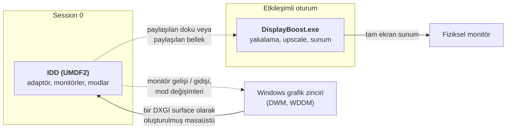

# 01 — Sanal ekran sürücüsü

> [English](../01-virtual-display-driver.md) | **Türkçe**

Sanal ekran, DisplayBoost'u mümkün kılan bileşen ve aynı zamanda sorun çıkarma olasılığı en yüksek
bileşen. Gerçek bir Windows sürücüsü, gerçek yetkilerle çalışıyor ve mimarinin bir kütüphane
çağrısıyla değiştirilemeyecek tek parçası.

## Indirect display driver nedir

**Indirect Display Driver** (IDD) modeli, fiziksel bir GPU output'una bağlı olmayan ekranlar
oluşturmanın Microsoft tarafından desteklenen yoludur. Belgelenmiş senaryolar arasında uzak
masaüstü, VDI için sanal ekranlar ve USB'ye bağlı ekran dongle'ları var.

Bir IDD, **IddCx** (Indirect Display Driver Class eXtension) karşısında yazılmış bir **UMDF2
kullanıcı modu sürücüsüdür**. Bu proje için önemli olan özellikler:

- **Kullanıcı modu** sürücüsüdür. Session 0'da `WUDFHost.exe` içinde çalışır ve sürücü
  dokümantasyonu kararsızlığının sistemin bütününün kararlılığını etkilemediğini belirtir. Pratik
  anlamı: bir hata mavi ekran yerine büyük olasılıkla donmuş bir ekran üretir.
- **Session 0'da, kullanıcı oturumu bileşeni olmadan** çalışır. Bu kritik: sürücü pencere
  oluşturamaz ve kullanıcının masaüstüne sunum yapamaz. Her türlü arayüz ayrı bir kullanıcı
  oturumu sürecinde yaşamak zorundadır.
- Masaüstü görüntüsünü işlemek için **herhangi bir DirectX API'sini** kullanabilir, ancak GDI,
  pencereleme API'leri, OpenGL veya Vulkan çağırmamalıdır.
- Tek bir binary'nin farklı Windows sürümlerinde çalışabilmesi için **universal Windows driver**
  olarak derlenmelidir.
- Derleme zamanında sürücü, hangi IddCx sürümüne karşı derlendiğini bildirir; işletim sistemi
  çalışma zamanında eşleşen IddCx sürümünü yükler.

Kaynak: [Indirect display driver overview](https://learn.microsoft.com/en-us/windows-hardware/drivers/display/indirect-display-driver-model-overview).

### Sürücünün şekli

Kesikli çizgi V2'ye ertelenen tasarım sorusudur: sürücünün karelerini, kare başına ekstra kopya
olmadan bir kullanıcı oturumu sürecine nasıl taşırız. Bkz.
[02 — Yakalama ve sunum](02-yakalama-ve-sunum.md).

## IddCx sürümleri ve Windows desteği

Microsoft Learn'e göre doğrulandı. Belirli bir IddCx sürümüne karşı derlenmiş bir sürücü, yalnızca
o sürümü veya daha yenisini taşıyan Windows sürümlerinde yüklenir.

| IddCx sürümü | `IddCxGetVersion` | Eklediği | Geldiği sürüm |
|---|---|---|---|
| **1.11** | `0x1B00` | **D3D12 desteği**, DisplayID-only descriptor'lar, atomik I2C, güncellenebilir static desktop reencode sayısı | Windows 11 |
| **1.10** | `0x1A80` | HDR10, SDR wide color gamut, runtime power management | Windows "2024" servicing |
| **1.10** | `0x1A00` | HDR10 ve SDR wide color gamut | Windows 11 23H2 |
| 1.9 | `0x1900` | `IddCxSetRealtimeGPUPriority`; UMDF process pooling'i yasaklar | Windows 11 22H2 |
| 1.8 | `0x1800` | `IDDCX_ADAPTER_FLAGS_PREFER_PRECISE_PRESENT_REGIONS` | Windows 11 21H2 |
| 1.7 | `0x1700` | `IddCxMonitorQueryHardwareCursor2`; `IDDCX_ADAPTER_FLAGS_CAN_USE_MOVE_REGIONS`'ı kullanımdan kaldırır | Windows Server 2022 |
| 1.6 | `0x1600` | `IddCxSwapChainGetPhysicallyContiguousAddress` | — |
| **1.5** | `0x1500` | `IddCxSwapChainInSystemMemory`, `IddCxSwapChainReleaseAndAcquireSystemBuffer` | Windows 10 20H1 – 22H2 |
| 1.4 | `0x1400` | Uzak oturum ID sürücüleri, `EvtIddCxMonitorGetPhysicalSize`, **`IddCxAdapterSetRenderAdapter`**, `IddCxAdapterDisplayConfigUpdate` | Windows 10 1903 / 1909 |
| 1.3 | `0x1300` / `0x1380` | 1.3+ sürümüne karşı derlenmiş sürücülerin yüklenebilmesi | Windows 10 1803 / 1809 |
| 1.2 | `0x1200` | `IddCxGetVersion`, `IddCxReportCriticalError`, `IddCxMonitorSetSrmList`, `IddCxMonitorGetSrmListVersion` | Windows 10 1709 |
| 1.0 | — | İlk sürüm | Windows 10 1607 / 1703 |

**DisplayBoost için anlamları:**

- **Windows 11 23H2 (IddCx 1.10) doğal hedef**, çünkü HDR10 ve wide color gamut orada geliyor.
- **Windows 10, IddCx 1.5'te kalıyor**, yani HDR yok ve D3D12 yok. Bir Windows 10 derlemesi
  `IddCxSwapChainReleaseAndAcquireBuffer2` yerine `...Buffer`'a düşmek zorunda.
- **D3D12 yalnızca IddCx 1.11 ile geliyor** ve kullanmak senkronizasyon modelini değiştiriyor:
  sürücü, yüzeyi hangi komut kuyruğunun okuyacağını işletim sistemine açıkça söylemek zorunda.
  D3D11 daha basit kalıyor ve hattın geri kalanıyla uyumlu.
- Daha yeni bir IddCx'e karşı derlenmiş bir sürücü, çalışma zamanı özellik kontrolleriyle eski
  Windows'ta da çalışabilir — `IddCxGetVersion` ve **herhangi bir adaptör oluşturulmadan önce
  çağrılması zorunlu olan** `IddCxCheckOsFeatureSupport`.

Kaynaklar: [IddCx versions](https://learn.microsoft.com/en-us/windows-hardware/drivers/display/iddcx-versions),
[Updates for IddCx 1.11 and later](https://learn.microsoft.com/en-us/windows-hardware/drivers/display/iddcx1-dot-11-updates).

## Önemli DDI'lar

| Callback veya fonksiyon | Rolü |
|---|---|
| `IddCxAdapterInitAsync` | Indirect display cihazını temsil eden grafik adaptörünü oluşturur |
| `EVT_IDD_CX_ADAPTER_COMMIT_MODES` | İşletim sistemi adaptörde bir mod değişimini onaylar |
| `IddCxMonitorCreate` / `IddCxMonitorCreate2` | Bir tanımdan monitör oluşturur |
| `IddCxMonitorArrival` / `IddCxMonitorDeparture` | Bir monitörün bağlanmasını veya çıkarılmasını bildirir |
| `EvtIddCxParseMonitorDescription` | Sürücü, verilen monitör tanımını ayrıştırıp doğrular |
| `EvtIddCxMonitorAssignSwapChain` / `...UnassignSwapChain` | İşletim sistemi kare teslimi için swapchain'i verir veya geri alır |
| `EvtIddCxSwapChainReleaseAndAcquireBuffer` | Sürücü önceki kareyi bırakır ve sonrakini alır |
| `IddCxSwapChainReleaseAndAcquireBuffer` | Oluşturulmuş masaüstü görüntüsünü bir DXGI kaynağı olarak alır |
| `IddCxSwapChainReleaseAndAcquireBuffer2` | FP16/HDR adaptörleri için zorunlu; sürücü bir `ID3D12Device` kaydettiyse D3D12 kaynağı döndürür |
| `IddCxSwapChainSetDevice` / `SetDevice2` | D3D11 veya D3D12 cihazını swapchain ile ilişkilendirir |
| `IddCxSwapChainFinishedProcessingFrame` | Sürücünün mevcut kareyle işinin bittiğini bildirir |
| `IddCxAdapterSetRenderAdapter` | Kareleri hangi GPU'nun işleyeceğini seçer — **adaptörler arası maliyetin azaltılması** |
| `IddCxSetRealtimeGPUPriority` | Gerçek zamanlı GPU önceliği talep eder (IddCx 1.9+) |

### Monitör tanımları

Bir IDD, monitörünün ne olduğunu işletim sistemine şu yollardan biriyle söyler:

- **Bir EDID bloğu** (`IDDCX_MONITOR_DESCRIPTION_TYPE_EDID`) — 128 baytlık temel blok ve isteğe
  bağlı uzantılar. Topluluk sürücüleri özel çözünürlükleri, yenileme hızlarını, renk derinliğini
  ve HDR metadata'sını bu şekilde duyurur.
- **Bir monitör mod listesi** — desteklenen modların daha basit, yapılandırılmış listesi.
- **DisplayID-only bir descriptor** (`IDDCX_MONITOR_DESCRIPTION_TYPE_DISPLAYID`) — IddCx
  1.11 ile yeni, hiç EDID bloğu içermeyen tanımlar için.

Sürücü, Windows'un sunmasını istediği her modu duyurmak zorundadır. Tanımda olmayan bir mod,
sürücü teknik olarak desteklese bile Ayarlar'da görünmez.

**DisplayBoost için kontrol yüzeyi burası.** Sanal ekranın tüm amacı, kasıtlı olarak küçük bir
düşük çözünürlük kümesi sunmak — 1280×720, 1366×768, 1600×900 — artı tam sayı dostu içerik
tercih eden kullanıcılar için 960×540 gibi 2× dostu seçenekler.

## Referans implementasyonlar

| Proje | IddCx | İmzalı | Lisans | Notlar |
|---|---|---|---|---|
| [microsoft/Windows-driver-samples — `video/IndirectDisplay`](https://github.com/microsoft/Windows-driver-samples/tree/main/video/IndirectDisplay) | 1.2 (örnek) | ✗ | **MS-PL** | Kanonik örnek. Tek monitör sıralar, HDR yok, konfigürasyon yok. Kurmak için test signing gerektirir. |
| [VirtualDrivers/Virtual-Display-Driver](https://github.com/VirtualDrivers/Virtual-Display-Driver) | **1.10** | ✅ | **MIT** | ~10.1k yıldız, 409 fork. HDR 10/12-bit, hardware cursor, özel EDID, ARM64, ondalıklı yenileme hızları. `vdd_settings.xml` ile yapılandırılır. Bir kontrol uygulamasıyla geliyor ve WinGet'te. |
| [nomi-san/parsec-vdd](https://github.com/nomi-san/parsec-vdd) | 1.5 | ✅ | (repoya bakın) | "ParsecVDisplay". Parsec'in VDD'sini kullanıcı modundan süren bağımsız bir sarmalayıcı. Aynı zamanda bir **SignPath Foundation** projesi. |
| `usbmmid_v2` (spacedesk / datronicsoft) | — | ✅ | Kapalı | Sadece 8-bit SDR. spacedesk ile dağıtılıyor. |
| [ge9/IddSampleDriver](https://github.com/ge9/IddSampleDriver) | 1.2 | ✗ | MIT / CC0 | Virtual Display Driver çalışmasının fork kaynağı. |
| [SudoMaker/SudoVDA](https://github.com/SudoMaker/SudoVDA) | — | ✗ | (repoya bakın) | MTT Virtual Display Driver soyundan gelen tam bir yeniden yazım. |

Virtual Display Driver projesinin kendi karşılaştırma tablosu, bu projelerdeki özellikleri
değiştikçe takip ettiği için doğrudan okumaya değer.

**DisplayBoost bunlardan ne alıyor:** *programlama modelini* (bir adaptörün ve monitörün nasıl
yapılandırılacağı, modların nasıl duyurulacağı) hepsi paylaşıyor. Yeni olan hedef: bu projelerin
hepsi kareyi *başka bir yere göndermek* için var (bir yayın, bir başlık takımı, bir kayıt
uygulaması), DisplayBoost ise onu yerel fiziksel ekrana geri gönderiyor.

## Sürücü imzalama ve dağıtım

Çoğu hobi ekran sürücüsü tam burada ölür, o yüzden somut olmakta fayda var.

**Kullanıcı imzasız bir sürücü kurabilir mi?** İşletim sistemini zayıflatmadan hayır. Mevcut kaçış
yolları:

- **Test signing**: `bcdedit /set testsigning on`, artı bir yeniden başlatma ve test imzalı bir
  paket. Her açılışta masaüstünde bir filigran görünür ve bazı anti-cheat yazılımları buna itiraz
  eder.
- **Açılışta Driver Signature Enforcement'ı devre dışı bırakmak.** Geçici, açılış başına, dağıtım
  stratejisi olarak kullanılamaz.

**Gerçek seçenekler:**

| Yol | Neyi gerektirir | Neye uygun |
|---|---|---|
| **Attestation signing** | Bir Microsoft Partner Center hesabı ve bir **EV kod imzalama sertifikası**; HLK testi yok | Bu proje dahil çoğu sürücü |
| **WHQL / HLK sertifikasyonu** | Aynısı, artı Hardware Lab Kit'e karşı resmî test | Logo sertifikasyonu isteyen üreticiler; burada gereksiz |
| **SignPath Foundation** | İncelemelerinden geçen bir açık kaynak projesi | **DisplayBoost için muhtemel yol** |

**SignPath Foundation**, uygun açık kaynak projelere ücretsiz OV seviyesi kod imzalama sağlıyor;
CI entegrasyonu var ve imzalama anahtarları Foundation'ın HSM'inde tutuluyor. Hem Virtual Display
Driver hem ParsecVDisplay bunu kullanıyor — ki bu, tam olarak bu tür bir proje için uygulanabilir
bir yol olduğunun güçlü kanıtı.

Kaynaklar: [SignPath Foundation](https://signpath.org/),
[Attestation Sign Windows Drivers](https://learn.microsoft.com/en-us/windows-hardware/drivers/dashboard/code-signing-attestation),
[Driver Code Signing Requirements](https://learn.microsoft.com/en-us/windows-hardware/drivers/dashboard/code-signing-reqs).

### Sürücünün lisansı üzerine bir not

Microsoft örneği **MS-PL**, MIT değil. DisplayBoost sürücüsünü bu örnekten türetirse, türetilmiş
sürücü kaynağı MS-PL altında kalmak zorunda ve repo karma lisanslı hale gelir. Alternatif,
sürücüyü belgelenmiş IddCx API'sine karşı sıfırdan yazmak; API dokümantasyonu buna izin veriyor
ama daha yavaş ve daha riskli. Bu açık bir karar ve
[03 — Ölçekleme](03-olcekleme.md) ile [06 — Yol haritası](06-yol-haritasi.md) içinde kayıtlı.

## Bilinen tuzaklar

| Tuzak | Detay |
|---|---|
| **GPU sürücüsü güncellemesinden sonra siyah ekran** | Virtual Display Driver projesi tarafından belgelenmiş: büyük bir GPU veya chipset sürücüsü güncellemesi sırasında Windows ekran cihazlarını yeniden sıralar ve sanal ekranı fizikselin önüne alabilir. Sanal ekranın fiziksel bir görüntüsü olmadığı için sonuç, çalışan bir sistemde siyah ekran. Onların tavsiyesi GPU sürücüsünü güncellemeden önce sanal ekranı kaldırmak ve `Win+P` veya Safe Mode ile kurtarmak. |
| **Windows 11 24H2'de ARM64** | İmzalı bir paket için bile test signing gerekebilir. |
| **HDR, Windows 11 23H2+ gerektirir** | HDR10'u ekleyen sürüm IddCx 1.10; öncesi bunu hiç yapamıyor. |
| **Monitör sayısı** | Windows toplam aktif ekran sayısını sınırlar ve her sürücü örneği genellikle bir monitör katkısı yapar. Sınırsız sanal ekran varsaymayın. |
| **Render adaptörü seçimi** | Hibrit sistemlerde render adaptörünü isimle eşleştirmek güvenilmez. Topluluk sürücüleri bunun yerine PCI bus numarasından kararlı bir `LUID` çözüyor — kopyalamaya değer bir detay. |
| **Kararsızlık atlatılabilir, görünmezlik atlatılamaz** | Çöken bir sanal ekran, Windows'un var olduğuna inandığı ama hiçbir şey göstermeyen bir monitör bırakır. Kaldırma yolu çalışan bir ekran olmadan da çalışmak zorundadır. |

## DisplayBoost için anlamları

1. **Windows 11 23H2+ üzerinde IddCx 1.10'u hedefleyin, Windows 10 için 1.5 fallback yolu
   bırakın.** HDR bir 1.10 özelliği ve 1.5 ile 1.10 arasındaki API farkları çalışma zamanı
   kontrolleriyle yönetilebilir.
2. **Küçük, kasıtlı bir mod listesi duyurun.** Sürücünün değeri her şeyi sunmakta değil, tam
   olarak anlamlı olan düşük çözünürlükleri sunmakta.
3. **Render adaptörünü açıkça sabitleyin** — `IddCxAdapterSetRenderAdapter` ve PCI'dan türetilmiş
   bir `LUID` ile; böylece hibrit sistemler kare başına adaptörler arası kopya ödemez.
4. **Sürücü sunum yapmaz.** Yalnızca kare üretir. Tüm pencereleme, imleç işi ve sunum kullanıcı
   oturumundaki uygulamada yaşar.
5. **Kod yazmadan önce imzalama yolunu planlayın.** SignPath Foundation'a başvurmak zaman alır ve
   önce reponun kurulmuş olması gerekir.
6. **Sanal ekranı asla tek ekran yapmayın.** Fiziksel monitör Windows console display'i olarak
   kalır; UAC'yi, kilit ekranını ve kurtarmayı kullanılabilir tutan şey budur.

## Okumaya devam

- [02 — Yakalama ve sunum](02-yakalama-ve-sunum.md) — karelere ne oluyor
- [03 — Ölçekleme](03-olcekleme.md) — sürücü kaynağı için lisans sorusu
- [05 — Riskler ve sınırlar](05-riskler-ve-sinirlar.md) — sürücünün başarısızlık modları
